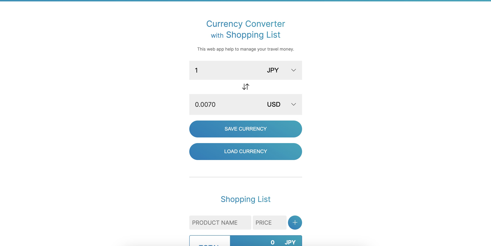

# Currency Converter with Shopping List
海外で買い物をする際「日本円ではいくらなのか？」を簡単に調べることができ、買い物リストを作り一時的に保存して確認できるWebアプリです。
※日本円以外も確認できます。

## 概要
- 様々な為替レートを取得することができる
- そのレートを元に、買い物リストを作成することができる
- よく使う人向けに、レートと買い物リストは一時保存が可能

URL: https://pss-aileen.github.io/project-shopping-list-currency-converter/

## 使い方
- 為替レートを設定
- 買い物リストを追加して価格を確認する
- レート、買い物リストを保存したい場合SAVE CURRENCY or SAVE SHOPPING LISTボタンを押す
- レート、買い物リストを呼び出したい場合LOAD CURRENCY or LOAD SHOPPING LISTボタンを押す

## 使用技術
- HTML/CSS
- JavaScript
- https://www.exchangerate-api.com/

## 制作について
- 制作期間（初回リリースまで）
  - 13日
- こだわり
  - 誰でも利用できるように全て英語表記
  - 為替レートを確認するだけでなく、買い物リストを追加することで実用性をアップさせた

---

#### [Version 1.0.0] 2023/12/22 RELEASE 🎉
